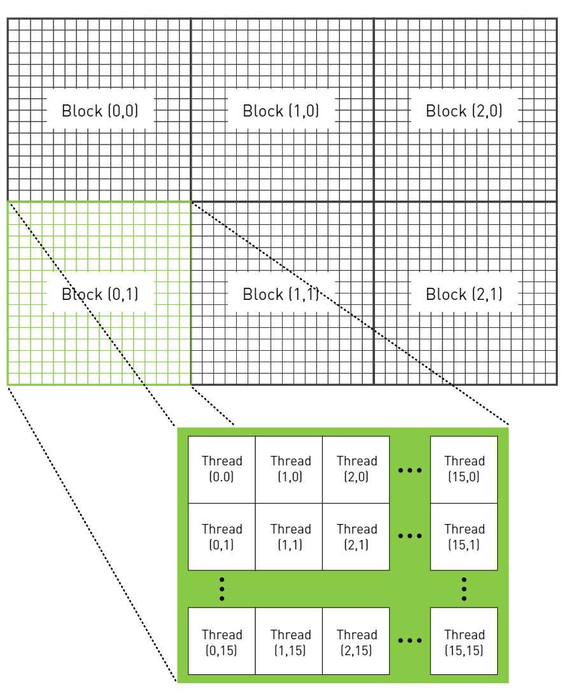
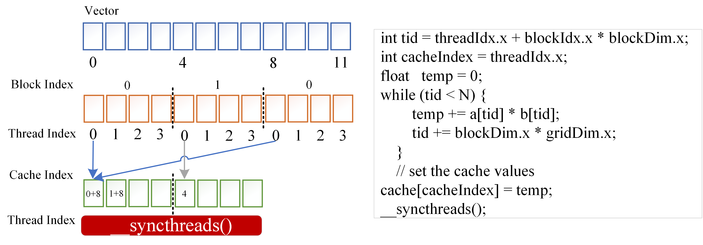
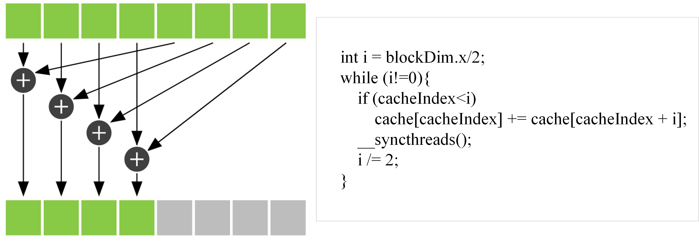
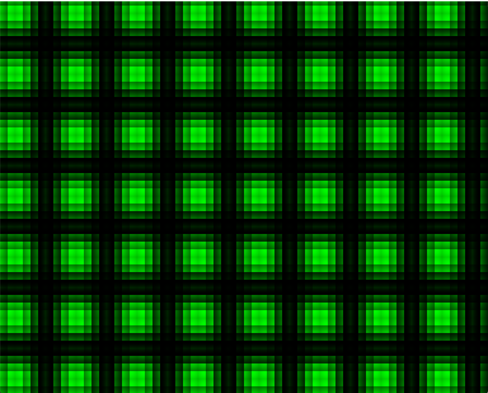
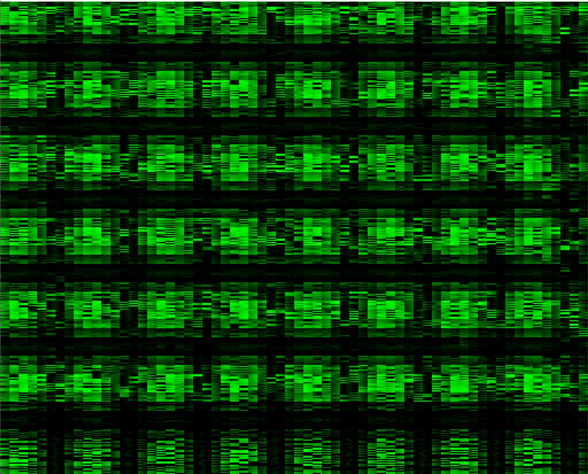

# Chapter 3

1. p26; 需要注意的点是为 device 声明的指针a内的*a值在 host 上是不可以读写的！因为CUDA只是利用了 host 上声明的&a地址，里面的值是unknown的，随意读写可能造成程序崩溃；在此基础上，也不难理解，为什么释放内存要用 cudafree(), 不用 free(), 因为内容根本就不在 host 为 device 声明的指针a地址的值中;
    ```
                    地址          值
    Host:
        d_a       0x001f      unknown  -> host 上为 device 声明的地址指针
        d_a_p     0x002f       0x001f  -> cudaMolloc() 用于管理地址指针的指针
    ```
2. p30-32; 简单介绍了一下如何查询设备的情况，这可以直接用 `deviceQuery.exe` 来查看，不一定要用程序去看 `cudaGetDeviceCount(), cudaGetDeviceProperties()`; 查这个属性一般是为了例如显卡是否支持双精度计算？

3. p34; 基于一些设定去选择我们所需要显卡; 
    ```c
    cudaDeviceProp  prop;
    int dev;
    memset( &prop, 0, sizeof( cudaDeviceProp ) );
    // 设定你需要的性能
    prop.major = 1;
    prop.minor = 3;
    // 挑一下显卡
    HANDLE_ERROR( cudaChooseDevice( &dev, &prop ) );
    // 设定显卡
    HANDLE_ERROR( cudaSetDevice( dev ) );
    ```
# Chapter 4

1. p44; 这里主要将之前在 `VectorAddition_block.cu` 代码中的关键字 `blockIdx` 进行了更为深刻的理解; 
    1. 为什么 `blockIdx` 不需要定义，就可以使用？
        1. 因为这是 CUDA builit-in 变量，在运行时 CUDA 会给我们定义的;
    2. 为什么有时候 `blockIdx.x` 有 `.x`?
        1. 因为 cuda 原始是为了方便图像处理或者矩阵计算，而图像索引自然有(x,y)两维; 在我们的问题中，使用一维的 x 就已经足够，所以`.x` 并不奇怪，甚至可以统一换为 `.y`;

2. p47; JULIA SET 代码; 详情见源码; 这里注意的是，在 CPU 调用模式下，耗时为 132686 us; 而采用 GPU 加速之后，耗时为 27.4 us; 这样带来的性能提升可达到 4842 倍！
    <p align="center">
    
    </p>

# Chapter 5

1. p59; 主要指明之前的编程存在一个弊端，各线程是没有联系的; 但其实高效的程序离不开 `communication` and `cooperate`; 在上述的`block`机制内，各`block`之间的无法联系的(由于物理架构限制的),但是本章将要的介绍的`Threads`线程，是在**单个`block`**的概念，这部分是可以实现联系的;

2. p61; 提出的`block`和`Threads`之间的关系，其实并行block能做的，并行threads也可以做，但是并行threads能做的，并行block却不一定能做；就比如接下来要讲到的 `shared_memory` 就是一个典型应用;

3. p61; Vector 这部分的代码已经写过了，请见 [VectorAddition_block](../Source%20Code%20of%20CUDA%20C%20Basics/VectorAddition_block.cu) 和 [VectorAddition_threads](../Source%20Code%20of%20CUDA%20C%20Basics/VectorAddition_threads.cu); 这两个方法在直观体现上是调用核函数时不同，会有相应的 `blockIdx` 以及 `threadIdx` 给并行计算单元加对应的索引 `index`;

4. p63; 解释对应2的问题，如果`threads`那么好，为什么不都用`threads`呢？这是由于`block`内的`threads`数是有限的，只有灵活得结合 `block` 和 `threads` 才能最大化并行计算单元数量;

5. p67; 见具体[代码](../Source%20Code%20of%20CUDA%20by%20Examples/chapter_5/threads_jump.cu);
    ```c
    blockDim.x,y,z 表示在某个特定方向上，一个block有多少个线程数 threads;
    gridDim.x,y,z  表示在某个特定方向上，整个计算图上有多少个 blocks;
    blockDim.x * gridDim.x 表示在 x 方向上，整个计算图所有的线程数 threads;
    ```

6. p71; 对于二维的 block 划分，二维 threads 块的划分，索引的部分依旧是一样的，无非是在GPU上由`threadIdx` 和 `blockIdx` 构成的索引要能够和**输入的数据**索引形成**唯一的一一映射关系**; 那么对于这GPU构成的索引部分，`threadIdx` 属于在 block 内的局部索引(在不同的block内相对位置是重复相同的)，而 `blockIdx` 则是属于 GPU 内的全局索引; 

    <p align="center">
    
    
    <p align="center">
    <font color="AAAAAA">索引构成</font>
    &emsp;&emsp;&emsp;&emsp;&emsp;&emsp;&emsp;&emsp;&emsp;&emsp;&emsp;&emsp;
    &emsp;&emsp;&emsp;&emsp;&emsp;&emsp;&emsp;
    <font color="AAAAAA">实现效果</font>
    </p>
    </p>

7. `shared Memory` 是针对**同一个** `block` 内的 `threads` 进行性能提升，通过共享内存，减少I/O读取时间，实现高效并行处理效果;

8. 对于`shared Memory`个人感觉最为重要的是:

    1. 每个 `block` 的 `shared Memory` 的内容都是各自独立的，相互之间不能访问;
    2. 每个 `block` 的 `shared Memory` 在并行计算时，负责的内容都是什么;

    3. `__syncthreads()` 的作用是什么？深入理解它的机制;
        1. `__syncthreads()` 从功能上是确保在cache内存内在执行下一步前，cache内所有与**改变内容相关的命令都**已经执行完毕; 因为各线程内由于各自的逻辑判断结果可能不一致，导致在同一时间时，各自在相同程序上执行的行数不一致，即会有不同执行 `branch`; 为了确保大家一起执行完这部分工作，让 GPU **各线程**都看到自己对应的 `__syncthreads()` 后，再一起向下执行，也就是说在cache内只要有线程 a 还没到`__syncthreads()`，其余已经执行完毕的线程都必须等线程 a ;
        2. `__syncthreads()` 设置的位置非常有讲究; 根据3.1中提到的特性；如果不设置`__syncthreads()`，可能会导致，在cache内的某些线程计算量大，没算完，就被匆匆忙忙结束，导致计算结果错误；如果`__syncthreads()`位置放错，例如有的线程不可能看到自己的 `__syncthreads()`，就导致 GPU 一直处于中断状态;

9. 具体详见 [VectorMulit.cu](../Source%20Code%20of%20CUDA%20by%20Examples/chapter_5/VectorMulit.cu) , 针对第一个，简单解释一下这里的向量乘法部分, 便于理解;
    <p align="center">
    
    </p>
    <p align="center">
    
    </p>

10. 具体详见 [syn_not.cu](../Source%20Code%20of%20CUDA%20by%20Examples/chapter_5/syn_not.cu), 是否使用 `__syncthreads()` 带来的效果差异;

    <p align="center">
    
    
    <p align="center">
    <font color="AAAAAA">无 __syncthreads() </font>
    &emsp;&emsp;&emsp;&emsp;&emsp;&emsp;&emsp;&emsp;&emsp;&emsp;&emsp;&emsp;
    <font color="AAAAAA">有 __syncthreads()</font>
    </p>
    </p>

# Chapter 6

1. 引入 `constant memory` 以及 `CUDA events` 概念; `constant memory` 是介于 `global memory` 和 `shared memory` 之间的产物，一方面解决 `shared memory` 存在只限于单个 `block` 中的问题， 另一方面解决多计算单元访问 `global memory` 带来的带宽负担;

2. p96; 引入 `ray tracing` 光线追踪概念; 这里做一个简单的沿 z 轴的光线追踪，来理解 `constant memory` 带来的性能提升;